# MASTER PROJECT SPECIFICATION: SUBSTRUCTURE CROSS-ATTENTION GNN FOR DRUG-DRUG INTERACTION
## Kursus IF542 Deep Learning — Magister Ilmu Komputer, Universitas Multimedia Nusantara (UMN)

> **Dokumen Spesifikasi Konteks Penuh (Master AI Context Prompt & Engineering Blueprints) — Versi Mutakhir**  
> **Status:** Ide penelitian dan perluasan ekosistem dataset telah disetujui secara resmi oleh Dosen Pengampu (**Dr. David Agustriawan, S.Kom., M.Sc., Ph.D.** & **Ajie Kusuma Wardhana, S.Kom., M.Eng.**).  
> **Author / Peneliti:** Kenny Valent Winalda Sembiring  
> **Tujuan Dokumen:** Memberikan spesifikasi teknis, arsitektur, formulasi matematis, dataset terintegrasi (EHR, Farmakogenomik, Afinitas Enzim), kode sumber, hasil eksperimen empiris, dan desain basis data relasional lengkap agar agen AI atau peneliti lain dapat melanjutkan pengerjaan proyek tanpa kehilangan konteks.

---

## 1. Ringkasan Eksekutif & Definisi Masalah

### 1.1. Latar Belakang Klinis
Pasien dengan penyakit kronis dan populasi lanjut usia sering kali menerima lebih dari satu resep obat secara bersamaan (**polifarmasi**). Fenomena **Drug-Drug Interaction (DDI)** terjadi ketika satu obat mengubah efek farmakokinetik atau farmakodinamik dari obat lain di dalam tubuh. Dampak DDI dapat berupa hilangnya efektivitas terapi hingga toksisitas fatal, seperti:
* **Warfarin (Antikoagulan) + Aspirin (Antiplatelet):** Sinergisme antikoagulasi dan kompetisi enzim metabolisme CYP2C9 memicu risiko perdarahan lambung mayor (*gastrointestinal hemorrhage*).
* **Simvastatin (Statin Penurun Kolesterol) + Amiodarone (Anti-aritmia):** Amiodarone menghambat kuat enzim CYP3A4, menyebabkan konsentrasi simvastatin di plasma melonjak hingga memicu *rhabdomyolysis* (kehancuran jaringan otot) dan gagal ginjal akut.

Dokter manusia tidak mungkin menghafal jutaan kombinasi pasangan obat dari ribuan senyawa yang disetujui FDA. Sistem AI berbasis Graph Neural Network (GNN) dikembangkan sebagai asisten skrining presisi tinggi sebelum resep diserahkan ke pasien.

### 1.2. Empat Celah Penelitian (Translational Research Gaps)
Sebagian besar literatur DDI deep learning sebelumnya memiliki kelemahan metodologis mendasar yang diperbaiki dalam riset ini:
1. **Over-Optimistic Evaluation (Scaffold Leakage):** Literatur umum membagi data latih dan uji menggunakan *Transductive Random Split*. Ini membiarkan senyawa obat dengan kerangka cincin kimiawi yang sama (*chemical analogs*) muncul di kedua set. Akibatnya, skor AUROC tinggi (~0.93) sering kali merupakan ilusi hafalan pola cincin, bukan pemahaman kimiawi asli.
2. **Unverified Explainability (XAI Kosmetik):** Visualisasi saliency map atau bobot atensi jarang divalidasi terhadap *ground truth* farmakofor kimiawi atau *structural alerts* biokimia yang sudah terbukti di laboratorium.
3. **Deployment Disconnect:** Arsitektur graf yang sangat rumit jarang diuji kelayakan *runtime*-nya pada prosesor mobile / edge (CPU klinik) dengan batasan memori (<1 MB) dan latensi instan (<15 ms).
4. **Pengabaian Faktor Pasien:** Model kimia memprediksi probabilitas obat secara statis, padahal tingkat bahaya suatu kombinasi obat sangat bergantung pada fungsi ginjal (eGFR) dan profil DNA enzim hati pasien (*CYP450 Pharmacogenomics*).

---

## 2. Empat Pilar Kontribusi Ilmiah Proyek

1. **Two-Stage Hierarchical Separation:**
   * **Stage 1 (Invarian Kimia Murni):** GNN Dual-Branch GATv2 memodelkan struktur atom, mengelompokkan atom menjadi $K=4$ gugus farmakofor via *Substructure Pooling*, lalu mencocokkan interaksi gugus Obat A dan B melalui *Bi-Directional Cross-Attention*. Memenuhi sifat komutatif mutlak: $f(A, B) \equiv f(B, A)$.
   * **Stage 2 (Personalisasi Pasien Bertingkat):** Menyesuaikan probabilitas kimia dasar menggunakan pergeseran logit adaptif (*Three-Tier Graceful Degradation*) berbasis usia/kehamilan (Tier 2 FAERS / MIMIC-IV) dan DNA/eGFR (Tier 3 CPIC / PharmGKB).
2. **Evaluasi Empiris Bebas Kebocoran (3-Partitioning Regimes):**
   * Menguji model pada tiga rezim partisi: *Random Transductive*, *Bemis-Murcko Scaffold-Disjoint*, dan *Inductive Cold-Start*.
   * Berhasil membuktikan penurunan AUROC dari **0.9493** (Random) ke **0.6605** (Scaffold), membuktikan adanya kebocoran scaffold pada literatur sebelumnya.
   * Mencapai **AUROC 0.7623** pada *Inductive Cold-Start* (menguji obat yang sama sekali belum pernah dilihat oleh model), **sejajar dengan** SOTA substruktur (GMPNN-CS 0.7748, SA-DDI 0.7914).
3. **Faithful Explainable AI (XAI) Ground Truth:**
   * Menggunakan *vanilla gradient saliency* (satu *backward pass* pada fitur atom) untuk atribusi atom penting, lalu mencocokkannya secara deterministik dengan pola SMARTS aturan biokimia resmi (*CYP450 inhibitor substructures* dan katalog *Brenk unwanted-substructure* RDKit).
4. **Edge Feasibility & Quantization Stability:**
   * Binary ONNX FP32 berukuran hanya **815.4 KB** (artefak run Kaggle terakhir; checkpoint lokal `models/molecular_gnn_ddi.onnx` = 834.0 KB) dengan latensi eksekusi hanya **~0.21 ms per pasang** pada satu *thread* ONNX Runtime CPU (tanpa GPU), diukur oleh `bench_onnx_latency.py` → `runs_kaggle/onnx_latency.json`.
   * Studi ablasi kuantisasi INT8 membuktikan korelasi peringkat atom Spearman $\rho = 0.9755$–$0.9852$ dan Jaccard overlap $83.8\%$–$93.4\%$, membuktikan representasi atensi silang tahan terhadap penurunan presisi.

---

## 3. Arsitektur Pipeline End-to-End & Formulasi Matematis

```
[Raw SMILES A & B] ──► [Tahap 0: Preprocessing RDKit] 
                              │ (Node x [N, 24]; edge_index [2, 2E] — tanpa edge_attr)
                              ▼
                       [Tahap 1: Molecular GNN]
                       • GATv2 Layers (3 Layer, D=64) ──► h [N, 64]
                       • Substructure Pooling (K=4) ──► Tokens [4, 64]
                       • Bi-Directional Cross-Attention ──► Attended Tokens
                       • Symmetric Commutative Fusion: [A*B, |A-B|]
                       • Classifier Head ──► S_mol ∈ [0, 1]
                       • (Rencana: ChEMBL Ki/IC50 CYP450 features — belum diimplementasikan)
                              │
                              ▼
                       [Tahap 2: Personalisasi Klinis Pasien (MIMIC-IV, FAERS, CPIC, PharmGKB)]
                       • Risk = σ(logit(S_mol) + Δ_demo + Δ_renal + Δ_pgx)
                         - Tier 1: S_mol murni (Fallback zero-knowledge)
                         - Tier 2: Penalti FAERS / MIMIC-IV Usia/Hamil/Hepar (+0.10 - +0.15)
                         - Tier 3: Penalti Ginjal eGFR & DNA Enzim CPIC/PharmGKB (+0.45)
                              │
                              ▼
                       [Tahap 3: Output & Audit Klinis]
                       • Skor Risiko Akhir Pasien
                       • Saliency Map Atom Pemicu Bahaya
                       • File ONNX Ringkas (815.4 KB, ~0.21 ms)
```

### 3.1. Formulasi Preprocessing (Level 1: SMILES ➔ Graf)
Setiap molekul obat direpresentasikan sebagai graf tidak berarah $\mathcal{G} = (\mathcal{V}, \mathcal{E})$:
* **Node Feature Vector ($x_v \in \mathbb{R}^{24}$):**
  1. *Simbol Unsur (One-hot 14 dimensi):* `[C, N, O, S, F, P, Cl, Br, I, B, Si, Na, K, Unknown]`.
  2. *Hibridisasi Orbital (One-hot 6 dimensi):* `[SP, SP2, SP3, SP3D, SP3D2, Unknown]`.
  3. *Derajat Valensi (1 dimensi):* $\text{TotalDegree} / 6.0$.
  4. *Muatan Formal (1 dimensi):* Nilai muatan ionik asli (misal $-1, 0, +1$).
  5. *Aromatisitas Cincin (1 dimensi):* $1$ jika aromatik, $0$ jika alifatik.
  6. *Jumlah Hidrogen (1 dimensi):* $\text{TotalNumHs} / 4.0$.
* **Edge Representation:** Graf saat ini hanya memakai **indeks ikatan** (`edge_index` $[2, 2E]$), bukan vektor fitur ikatan. Setiap ikatan kimia kovalen diduplikasi bolak-balik: $(u \rightarrow v)$ dan $(v \rightarrow u)$. (`GATv2Layer` tidak membaca `edge_attr`, sehingga `smiles_to_graph_rdkit` sengaja tidak menghitungnya; vektor fitur ikatan 6-dimensi — tipe ikatan, konjugasi, status cincin — adalah rencana, bukan implementasi aktif.)

### 3.2. Formulasi Stage 1: Dual-Branch Cross-Attention GNN
1. **Linear Atom Projection:**
   $$h_i^{(0)} = \text{LeakyReLU}\left(W_{\text{proj}} x_i\right) \in \mathbb{R}^{64}$$
2. **GATv2 Message Passing (3 Layer, Shared Siamese Weights):**
   $$\alpha_{ij} = \frac{\exp\left(\text{LeakyReLU}\left(a^T [W_{\text{src}} h_i + W_{\text{dst}} h_j]\right)\right)}{\sum_{k \in \mathcal{N}_i} \exp\left(\text{LeakyReLU}\left(a^T [W_{\text{src}} h_i + W_{\text{dst}} h_k]\right)\right)}$$
   $$h_i^{(l)} = \text{LeakyReLU}\left(\text{LayerNorm}\left(h_i^{(l-1)} + \sum_{j \in \mathcal{N}_i} \alpha_{ij} W_{\text{src}} h_j^{(l-1)}\right)\right)$$
3. **Substructure Pooling (Soft Pharmacophore Clustering):**
   Atom-atom di molekul dikelompokkan ke dalam $K=4$ token farmakofor fungsional:
   $$w_{i, k} = \text{softmax}\left(W_{\text{assign}} h_i\right) \in \mathbb{R}^K$$
   $$T_k = \frac{\sum_{i \in \mathcal{V}} w_{i, k} \cdot h_i}{\sum_{i \in \mathcal{V}} w_{i, k} + \epsilon} \in \mathbb{R}^{64} \implies \text{Tokens} \in \mathbb{R}^{K \times 64}$$
4. **Bi-Directional Cross-Attention:**
   $$\text{Att}_A = \text{MultiHeadAttn}\left(Q=T_A, K=T_B, V=T_B\right)$$
   $$\text{Att}_B = \text{MultiHeadAttn}\left(Q=T_B, K=T_A, V=T_A\right)$$
5. **Symmetric Commutative Fusion:**
   Menjamin $f(A, B) \equiv f(B, A)$ secara matematis:
   $$z_{\text{pair}} = \left[ \text{vec}(\text{Att}_A) \odot \text{vec}(\text{Att}_B) \;\parallel\; |\text{vec}(\text{Att}_A) - \text{vec}(\text{Att}_B)| \right] \in \mathbb{R}^{2 \cdot K \cdot D} = \mathbb{R}^{512}$$
6. **Classification Head:**
   $$\text{logits} = \text{MLP}(z_{\text{pair}}), \quad S_{\text{mol}} = \sigma(\text{logits})$$

### 3.3. Formulasi Stage 2: Personalisasi Klinis Pasien (Three-Tier Degradation)
Penyesuaian risiko dilakukan di ruang logit:
$$\text{logit}(S_{\text{mol}}) = \ln\left(\frac{S_{\text{mol}}}{1 - S_{\text{mol}}}\right)$$
$$\text{Risk}_{\text{final}} = \sigma\left(\text{logit}(S_{\text{mol}}) + \Delta_{\text{demo}} + \Delta_{\text{renal}} + \Delta_{\text{pgx}}\right)$$
* **Tier 1 (Fallback / Data Pasien Nihil):**
  $$\Delta_{\text{demo}} = \Delta_{\text{renal}} = \Delta_{\text{pgx}} = 0 \implies \text{Risk}_{\text{final}} = S_{\text{mol}}$$
* **Tier 2 (Demografis FAERS / MIMIC-IV):**
  * Usia $\ge 65$ tahun: $\Delta_{\text{age}} = +0.15$
  * Kehamilan: $\Delta_{\text{preg}} = +0.10$
  * Riwayat kerusakan hepar / komorbiditas: $\Delta_{\text{hep}} = +0.12$
* **Tier 3 (Farmakogenomik CPIC, PharmGKB & Klirens Ginjal MIMIC-IV):**
  * Penurunan fungsi ginjal: $\Delta_{\text{renal}} = \min\left(0.25, \max\left(0, \left(1 - \frac{\text{eGFR}}{90}\right) \times 0.25\right)\right)$
  * Genotipe *Poor Metabolizer* enzim CYP450 (misal *CYP2C9 \*2/\*3, CYP2C19 \*2/\*2, CYP2D6 \*4/\*4, CYP3A4 \*22/\*22*): $\Delta_{\text{pgx}} = +0.45$

---

## 4. Ekosistem Dataset Terpadu (12 Dataset Multi-Sumber)

Proyek ini mengintegrasikan ekosistem data komprehensif yang mencakup tingkat molekul, uji aktivitas enzim, pelaporan efek samping populasi, hingga rekam medis elektronik pasien nyata:

| No | Kategori | Nama Dataset | Sumber Data | Ukuran / Cakupan | Peran Spesifik dalam Sistem |
| :---: | :--- | :--- | :--- | :---: | :--- |
| 1 | **Molekuler** | **TDC DrugBank DDI** | Therapeutics Data Commons | 191.402 pos (dedup) ➔ 382.804 balanced (seed 42) | Dataset latih dan uji skala penuh GNN (1.706 obat). |
| 2 | **Topologi** | **Stanford BioSNAP** | Stanford SNAP (`ChCh-Miner`) | 48.514 pasangan | Rencana: verifikasi edgelist & degree centrality (belum diimplementasikan; file tidak disimpan di repo, unduh via `data/download_dataset.py`). |
| 3 | **Kamus Molekul** | **Kamus Molekul FDA** | `drugs_database.json` | 20 obat inti | Autocomplete instan antarmuka klinis & API lookup. |
| 4 | **Benchmark** | **Pilot Terkurasi** | `sample_ddi.csv` | 30 pasangan | Evaluasi cepat unit test & verifikasi hold-out klinis. |
| 5 | **Farmakovigilans** | **FDA FAERS Sample** | FDA MedWatch Reports | 10 kasus terpilih | Validasi klinis kejadian buruk nyata (rawat inap/kematian). |
| 6 | **Farmakogenomik** | **CPIC Guidelines** | CPIC Level A Tables | 10 panduan alel | Aturan dosis berbasis genotipe alel enzim hati (Stage 2 Tier 3). |
| 7 | **Ground Truth XAI** | **CYP450 / Brenk SMARTS** | Aturan Biokimia Laboratorium | 11 pola SMARTS + katalog Brenk RDKit | Pembuktian validitas atribusi atom (vanilla gradient saliency). |
| 8 | **EHR Pasien Riil** | **MIMIC-IV v2.2 / v3.0** | PhysioNet / MIT & BIDMC | >70.000 Pasien ICU | Kalibrasi empiris penalti resep polifarmasi & lab eGFR/ALT. |
| 9 | **Farmakogenomik** | **PharmGKB** | NIH & Stanford University | >4.500 Variant-Drug | Memperluas pemetaan alel genetik pasien di luar 4 enzim CYP. |
| 10 | **Bioaktivitas Kuantitatif**| **ChEMBL 34 & BindingDB** | EMBL-EBI | Jutaan nilai Ki / IC50 | *Rencana*: nilai afinitas ikatan enzim CYP450 untuk fusion head Stage 1 (belum diimplementasikan — lihat §9). |
| 11 | **Efek Fenotipe** | **TwoSides Dataset** | Tatonetti Lab, Columbia | 63.473 pasang (1.318 efek) | Memetakan prediksi DDI biner ke jenis efek samping spesifik. |
| 12 | **Polifarmasi Tingkat Tinggi**| **HODDI Dataset (2024)** | Riset DDI Multiobat | Interaksi 3–5 obat | Deteksi interaksi resep kompleks pada pasien lansia komorbid. |

---

## 5. Hasil Eksperimen Empiris (Full-Scale 2× Tesla T4 GPU)

Model dilatih pada Kaggle environment (2× Tesla T4 16GB, PyTorch 2.10.0+cu128, batch size 256, AdamW lr $10^{-3}$, ReduceLROnPlateau).

### 5.1. Tabel Performa Lintas-Rezim Evaluasi

| Rezim Evaluasi | Jumlah Train | Jumlah Test | AUROC | AUPRC | Akurasi | F1-Score | Catatan / Temuan Ilmiah |
| :--- | :---: | :---: | :---: | :---: | :---: | :---: | :--- |
| **Random Split (Transductive)** | 305.766 | 38.488 | **0.9493** | **0.9482** | **87.19%** | **0.8769** | Benchmark standar literatur; rentan optimistik karena kebocoran analog. |
| **Scaffold Disjoint (Murcko)** | 200.383 | 10.979 | **0.6605** | **0.5981** | **66.31%** | **0.4691** | Penurunan tajam (-0.2888 AUROC) membuktikan ketergantungan model pada kerangka cincin. |
| **Inductive Cold-Start** | 258.988 | 3.493 | **0.7623** | **0.7596** | **68.94%** | **0.6695** | **Sejajar dengan SOTA substruktur** (GMPNN-CS 0.7748, SA-DDI 0.7914) pada prediksi obat yang sama sekali baru. |

> Sumber angka: `runs_kaggle/{random,scaffold,cold_start}/summary.json` (run Kaggle 2×T4 terakhir). Berkas lama `kaggle_artifacts/*_summary.json` (Random 0.9307 / Scaffold 0.6912 / Cold-Start 0.7648) berasal dari run 15-epoch sebelumnya dan tidak lagi dipakai sebagai rujukan benchmark.

### 5.2. Hasil Uji Panel Klinis Terisolasi (Held-Out Clinical Panel)
Panel kuantitatif ini dihitung oleh `kaggle_train.py` dan tersimpan di `clinical_panel` setiap `summary.json`. Untuk rezim Random: pasangan **Warfarin + Aspirin** (satu-satunya pasangan hold-out yang SMILES-nya cocok dengan dataset) → Stage 1 $S_{\text{mol}} = 0.8851$; Tier 2 (usia 68, terkalibrasi FAERS) $= 0.9224$; Tier 3 (usia 68, eGFR 35, genotipe CYP2C9 \*2/\*3) $= 0.9560$. Motif CYP yang terdeteksi: `CYP2C9_coumarin` (warfarin) dan `CYP2C9_benzoic_acid`, `CYP2C9_carboxylate` (aspirin). Pasangan Simvastatin+Amiodarone **tidak ada** di dataset TDC yang dipakai, sehingga tidak dapat dihitung (dicatat di log: *"clinical pair Simvastatin+Amiodarone absent from dataset (no SMILES match)"*).

---

## 6. Entity-Relationship Diagram (ERD) & Desain Database Diperluas

Sistem didukung skema relasional 11 entitas yang menghubungkan struktur atom, afinitas enzim kuantitatif (ChEMBL), rekam medis pasien ICU (MIMIC-IV), profil genetik (CPIC/PharmGKB), serta log audit inferensi AI:

```mermaid
erDiagram
    DRUG ||--o{ MOLECULAR_GRAPH : "memiliki"
    DRUG ||--o{ DDI_PAIR : "sebagai Drug 1"
    DRUG ||--o{ DDI_PAIR : "sebagai Drug 2"
    DRUG ||--o{ ENZYME_BIOACTIVITY_ASSAY : "diuji pada"
    
    MOLECULAR_GRAPH ||--|{ GRAPH_NODE_ATOM : "terdiri dari"
    MOLECULAR_GRAPH ||--|{ GRAPH_EDGE_BOND : "terdiri dari"
    
    DDI_PAIR ||--o{ PREDICTION_AUDIT_LOG : "dievaluasi"
    DDI_PAIR ||--o{ FAERS_ADVERSE_REPORT : "dilaporkan di"
    DDI_PAIR ||--o{ TWOSIDES_PHENOTYPE_EFFECT : "memiliki efek"
    
    PATIENT_CLINICAL_PROFILE ||--o{ PREDICTION_AUDIT_LOG : "menerima resep"
    PATIENT_CLINICAL_PROFILE ||--o{ PATIENT_GENOTYPE : "memiliki alel"
    PATIENT_CLINICAL_PROFILE ||--o{ MIMIC_EHR_PRESCRIPTION : "tercatat di"
    PATIENT_CLINICAL_PROFILE ||--o{ MIMIC_EHR_LAB_EVENT : "memiliki hasil lab"

    DRUG {
        string drugbank_id PK "Contoh: DB00682"
        string common_name "Warfarin, Aspirin"
        string canonical_smiles "Rumus teks standar"
        string murcko_scaffold_hash "Hash MD5 cincin"
        float molecular_weight
    }
    ENZYME_BIOACTIVITY_ASSAY {
        int assay_id PK
        string drugbank_id FK
        string target_enzyme "CYP3A4, CYP2C9, P-gp"
        float ic50_nm "Kadar inhibisi IC50"
        float ki_nm "Konstanta inhibisi Ki"
        string source_database "ChEMBL 34, BindingDB"
    }
    MOLECULAR_GRAPH {
        int graph_id PK
        string drugbank_id FK
        int num_nodes "Jumlah atom"
        int num_edges "Jumlah ikatan x 2"
        float graph_density
    }
    GRAPH_NODE_ATOM {
        int atom_id PK
        int graph_id FK
        int atom_index
        string symbol "C, N, O, S, dll"
        string hybridization "SP, SP2, SP3"
        int degree
        float formal_charge
        boolean is_aromatic
        int hydrogen_count
    }
    GRAPH_EDGE_BOND {
        int edge_id PK
        int graph_id FK
        int src_node_idx
        int dst_node_idx
        string bond_type "SINGLE, DOUBLE, AROMATIC"
        boolean is_conjugated
        boolean is_in_ring
    }
    DDI_PAIR {
        int pair_id PK
        string drug1_id FK
        string drug2_id FK
        int interaction_label "1 = Bahaya, 0 = Aman"
        string split_regime "random, scaffold, cold_start"
        boolean is_clinical_holdout
    }
    TWOSIDES_PHENOTYPE_EFFECT {
        int effect_id PK
        int pair_id FK
        string adverse_event_name "Gastrointestinal hemorrhage"
        float mean_reporting_ratio
    }
    FAERS_ADVERSE_REPORT {
        int report_id PK
        int pair_id FK
        int patient_age
        string patient_gender
        string adverse_event_term
        float reporting_odds_ratio
    }
    PATIENT_CLINICAL_PROFILE {
        int patient_id PK
        string medical_record_no UK "Nomor Rekam Medis"
        int age
        boolean is_pregnant
        float egfr_value "Laju filtrasi ginjal"
        string renal_stage "Stage 1 s/d 5"
        boolean hepatic_impairment
    }
    MIMIC_EHR_PRESCRIPTION {
        int prescription_id PK
        int patient_id FK
        string drug_name
        datetime start_time
        datetime stop_time
        string dose_val_rx
    }
    MIMIC_EHR_LAB_EVENT {
        int lab_event_id PK
        int patient_id FK
        string test_item "Serum Creatinine, ALT, AST"
        float test_value
        datetime chart_time
    }
    PATIENT_GENOTYPE {
        int genotype_id PK
        int patient_id FK
        string gene_symbol "CYP2C9, CYP2D6, SLCO1B1"
        string diplotype "*1/*3, *4/*4, 521T>C"
        string phenotype "Poor, Intermediate, Normal"
        string source_knowledgebase "CPIC, PharmGKB"
    }
    PREDICTION_AUDIT_LOG {
        int log_id PK
        int patient_id FK
        int pair_id FK
        float stage1_mol_prob
        float stage2_adjusted_risk
        int tier_applied
        json top_atom_attributions
        datetime timestamp
    }
```



---

## 7. Rekayasa Komputasi Edge & Keputusan Kuantisasi

### 7.1. Mengapa Binary Deployment Mempertahankan FP32?
1. **Ukuran File Sangat Ringkas:** Total parameter model hanya 118.021 parameter ($D=64$). File binary ONNX utuh berukuran **815.4 KB** (artefak run Kaggle terakhir; checkpoint `models/molecular_gnn_ddi.onnx` = 834.0 KB) — di bawah batas anggaran memori mobile 1 MB.
2. **Latensi CPU Instan:** Hanya **~0.21 ms per pasangan obat** pada satu *thread* ONNX Runtime CPU tanpa GPU (≈4.7k skrining per detik; diukur oleh `bench_onnx_latency.py`).
3. **Kompatibilitas Runtime Graf:** Kuantisasi dinamis INT8 pada graf dengan ukuran atom dinamis (`dynamic_shapes`) memicu error kompatibilitas kernel shape inference pada operator `MatMulInteger` di ONNX Runtime (artefak INT8 yang dihasilkan, 518.3 KB, gagal dimuat). Mempertahankan FP32 menjamin stabilitas inferensi tanpa risiko aplikasi klinik crash.
4. **Presisi Numerik:** Selisih output antara PyTorch dan ONNX Runtime tercatat pada log parity run: $5.81 \times 10^{-7}$ (random), $5.22 \times 10^{-8}$ (scaffold), $2.24 \times 10^{-8}$ (cold-start).

### 7.2. Keberhasilan Studi Ablasi Kuantisasi INT8 (Aspek Riset)
* Pengujian simulasi kuantisasi bobot INT8 (`emulate_int8_weights`) dilakukan pada 400 pasangan obat test set per rezim.
* **Spearman Rank Correlation ($\rho$) rata-rata:** **0.9755** (random), **0.9852** (scaffold), **0.9781** (cold-start) — semuanya di atas batas minimum $0.85$.
* **Top-5 Atom Jaccard Overlap rata-rata:** **0.8378** (random), **0.9343** (scaffold), **0.8504** (cold-start).
* **Kesimpulan Ilmiah:** Atribusi atom *Explainable AI* terbukti tangguh dan tidak mengalami distorsi akibat pemotongan presisi bobot.

---

## 8. Struktur Direktori Proyek Lokal & Artefak Tersedia

Direktori proyek berada di `/Users/kennyvws/projects/molecular-gnn-ddi/` dengan struktur:

```
molecular-gnn-ddi/
├── MASTER_PROJECT_SPECIFICATION.md    # Dokumen master konteks proyek ini
├── PharmaGNN_DDI_Master_Pipeline.ipynb # Master Jupyter Notebook siap jalan (Colab/Kaggle)
├── README.md                          # Dokumentasi instruksi instalasi & CLI
├── train.py                           # CLI training pipeline lokal
├── kaggle_train.py                    # Script eksekutor training skala penuh Kaggle
├── kaggle_run.py                      # Orkestrator run Kaggle 2×T4 (dataset + 3 split)
├── models/
│   ├── best_model.pt                  # Bobot model terlatih PyTorch
│   ├── molecular_gnn_ddi.onnx         # Model terkompilasi ONNX Opset 18 (FP32, 834.0 KB)
│   └── molecular_gnn_ddi_int8.onnx    # Artefak kuantisasi INT8 (518.3 KB; gagal dimuat ORT)
├── runs_kaggle/                       # Artefak run training riil 3 split dari Kaggle 2×T4
│   ├── random/summary.json            # Metrik lengkap Random split (AUROC 0.9493)
│   ├── scaffold/summary.json          # Metrik lengkap Scaffold split (AUROC 0.6605)
│   ├── cold_start/summary.json        # Metrik lengkap Cold-Start split (AUROC 0.7623)
│   └── logs/                          # Log training + parity ONNX per rezim
├── kaggle_artifacts/                  # Arsip run Kaggle 15-epoch sebelumnya
│   ├── random_summary.json            # Random split (AUROC 0.9307)
│   ├── scaffold_summary.json          # Scaffold split (AUROC 0.6912)
│   ├── cold_start_summary.json        # Cold-Start split (AUROC 0.7648)
│   └── random_molecular_gnn_ddi.onnx  # Binary ONNX hasil run Kaggle (826.5 KB)
├── src/
│   ├── model.py                       # GATv2Layer, SubstructurePooler, CrossAttention, GNN
│   ├── dataset.py                     # smiles_to_graph, hashed split, DDIDataset, collate
│   ├── personalization.py             # PatientRiskAdjustment (Tier 1, 2, 3 logit shifts)
│   ├── explain.py                     # Vanilla gradient saliency & CYP450 SMARTS validator
│   ├── export_onnx.py                 # ONNX export wrapper & INT8 weight emulator
│   └── utils.py                       # Metrik AUROC, AUPRC, Akurasi, F1, seed setup
├── tests/
│   ├── test_full_suite.py             # Test suite lengkap (jalankan: python -m pytest tests/ -q)
│   └── test_pipeline.py               # Acceptance test 2-stage DDI pipeline
└── data/
    ├── sample_ddi.csv                 # 30 pasangan terkurasi
    ├── drugs_database.json            # Kamus 20 obat FDA
    └── ChCh-Miner_durgbank-chem-chem.tsv.gz # Edgelist BioSNAP 48.514 baris (terkompresi)
```

---

## 9. Rencana Kerja & Integrasi Lanjutan (Next Execution Steps)

1. **Integrasi Kohort Rekam Medis MIMIC-IV:**
   * Mengekstrak sub-kohort pasien ICU gagal ginjal dan lansia dengan terapi polifarmasi aktif untuk validasi prospektif Stage 2.
2. **Injeksi Fitur Bioaktivitas Enzim ChEMBL 34:**
   * Mengintegrasikan nilai afinitas pengikatan kuantitatif ($K_i$ / $IC_{50}$) pada enzim CYP3A4, CYP2C9, dan transporter P-gp ke dalam fusion head Stage 1 untuk mendorong AUROC Cold-Start dari **0.7623** menuju target **>0.820** (belum diimplementasikan; angka target adalah hipotesis, bukan hasil terukur).
3. **Penulisan Manuskrip Paper Konferensi IEEE (8–10 Halaman):**
   * Menyusun naskah lengkap menggunakan format standar *IEEE Transactions on Computational Biology and Bioinformatics* / IEEE BIBM.

### 9.1. Keterbatasan Metodologis (Disclosure Wajib)

* **Negatif sintetis 1:1.** Label negatif adalah pasangan obat acak (*uniform negative sampling*), bukan interaksi terkonfirmasi absen — tepat **191.402:191.402 (50/50)**. DrugBank DDI riil ~1:4. **AUPRC/F1 diukur pada *base rate* 50% yang tidak klinis**; akan turun tajam pada prevalensi riil.
* **Split scaffold membuang 43,5% data.** 166.621 dari 382.804 baris dibuang sebagai *straddler*; split scaffold dilatih pada ~200k vs random ~306k → **perbandingan antar-rezim tidak setara pada volume training**. Cold-start membuang 117.455 baris.
* **Threshold belum dikalibrasi.** Ambang 0,5 dan batas risiko 0,7/0,4 hardcoded, bukan diturunkan dari val set.
* **Klaim tanpa implementasi.** ChEMBL/BindingDB, TwoSides, MIMIC-IV EHR, HODDI belum diimplementasikan (lihat §4 dan README).
