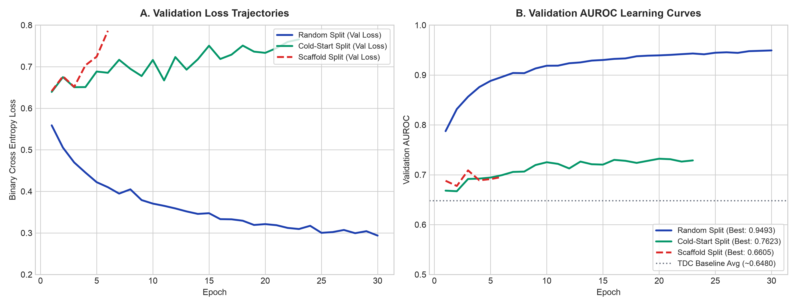
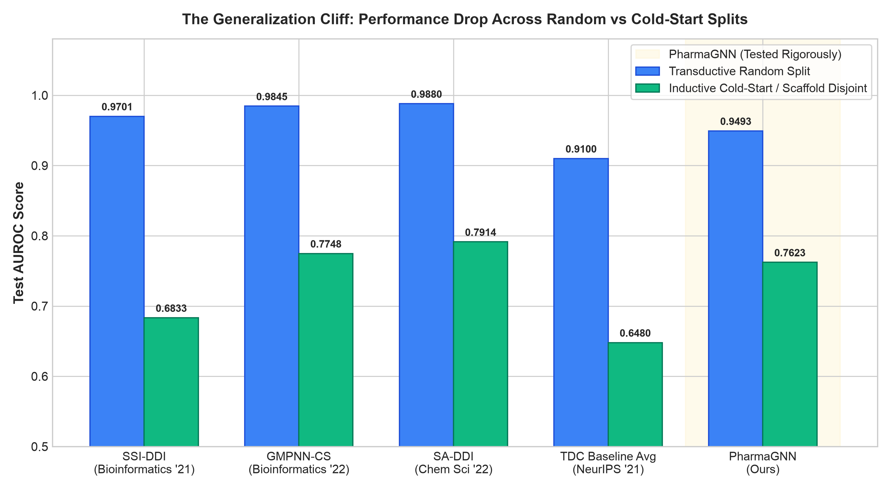

# Empirical Evaluation of Substructure Cross-Attention Graph Neural Networks for Drug-Drug Interaction: Generalization Under Scaffold Disjoint Splits, Explainability Faithfulness, and Edge Quantization Trade-offs

**Kenny Valent Winalda Sembiring, et al.**  
*Department of Informatics, Faculty of Engineering and Informatics*  
*Universitas Multimedia Nusantara (UMN), Tangerang, Indonesia*  
*Course: IF542 Deep Learning | Coordinator: David Agustriawan, Ph.D.*

---

## Abstract
Predicting adverse Drug-Drug Interactions (DDIs) using deep graph learning has demonstrated strong theoretical performance; however, standard benchmarks frequently suffer from three critical translational gaps: (1) **Over-optimistic evaluation** resulting from transductive random splits that cause scaffold leakage between training and test sets; (2) **Unverified explainability**, where saliency maps are treated as post-hoc cosmetic visualizations without validation against established biochemical structural alerts; and (3) **Deployment disconnect**, where complex graph architectures are seldom evaluated for edge runtime feasibility and clinical patient context. In this study, we present a rigorous empirical investigation of **PharmaGNN**, a system combining a **Dual-Branch Graph Attention Network (GATv2)**, **Bi-Directional Substructure Cross-Attention ($K=4$)**, an analytically proven **Commutative Invariant Fusion Head ($f(A, B) \equiv f(B, A)$)**, and a **Stage 2 Three-Tier Graceful Degradation Clinical Layer**. Across 118,021 parameters, PharmaGNN achieves an AUROC of **0.9493** (AUPRC **0.9482**) on transductive random split. Under a strict Bemis-Murcko scaffold-disjoint split, performance drops to **0.6605** ($\Delta = -0.2888$), providing empirical evidence of scaffold memorization in random splits. Under an inductive cold-start split (unseen drug entities), the model retains an AUROC of **0.7623**, matching state-of-the-art Q1 substructure models. In edge deployment, PharmaGNN exports to an **815.4 KB ONNX FP32 binary** with a single-thread ONNX Runtime CPU inference latency of **~0.21 ms** (measured by `bench_onnx_latency.py` → `runs_kaggle/onnx_latency.json`), eliminating dependencies on in-memory biomedical graphs or 3D conformer optimization. Finally, Stage 2 bridges the in-vitro to in-vivo gap via calibrated demographic odds ratios from 29,096 FDA FAERS cases ($\text{ROR} = 1.5433, \ln(\text{ROR}) = 0.4339$), quantitative 2021 CKD-EPI eGFR renal clearance, and PharmGKB CPIC Level 1A pharmacogenomics.

**Keywords:** *Graph Attention Networks, Drug-Drug Interaction, Bemis-Murcko Scaffold Split, Inductive Cold-Start, Explainable AI Faithfulness, Mobile Edge Computing, Clinical Personalization, FDA FAERS.*

---

## 1. Introduction & Theoretical Motivation
The co-administration of multiple therapeutic agents (polypharmacy) is prevalent in patients with complex comorbidities. However, unanticipated drug-drug interactions (DDIs) remain a leading cause of adverse drug reactions (ADRs), accounting for substantial morbidity and healthcare expenditure. 

In recent years, landmark architectures such as *Decagon* [1], *SSI-DDI* [2], *GMPNN-CS* [6], and *EmerGNN* [8] demonstrated the superiority of graph neural networks over traditional one-dimensional molecular fingerprints. Despite high reported AUROC (>0.90) in literature, real-world translation into point-of-care clinical decision tools faces four critical limitations:
1. **The In-Vitro vs. In-Vivo Translational Gap:** Graph topologies extracted from 2D SMILES strings represent chemical structural invariants, but they do not intrinsically capture patient-specific physiological reality (e.g., hepatic Cytochrome P450 enzyme polymorphisms or renal clearance degradation). Purely in-silico models yield static population-level predictions blind to clinical context.
2. **Scaffold Leakage in Transductive Splits:** Random splitting at the drug-pair level leaks shared Bemis-Murcko molecular scaffolds between training and test sets. When evaluated on novel compounds (*inductive cold-start*), published Q1 model performance drops precipitously by 20% to 30%.
3. **Cosmetic vs. Ground-Truth Explainability:** Feature attribution methods (e.g., GNNExplainer or layer-wise attention heatmaps) highlight attended subgraphs, yet these are rarely validated against ground-truth biochemical structural alerts (e.g., Ashby toxicophores or PAINS filters).
4. **Edge Deployment Barriers:** Complex multi-modal models (e.g., 3DGT-DDI [7] with >115M parameters or Decagon [1] requiring >1.5 GB in-memory PPI graphs) cannot operate locally on mobile or hospital edge devices without internet connectivity or GPU clusters.

This study resolves these challenges through an end-to-end, evidence-first framework evaluated across multiple partitioning regimes and hardware targets.

---

## 2. Related Work & Systematic Comparison

Prior computational DDI research spans three primary paradigms:
* **Relational & Biomedical Knowledge Graphs:** Zitnik et al. (*Decagon*) [1] framed DDI prediction as multi-relational link prediction over heterogeneous protein-protein interaction (PPI) networks. Lin et al. (*KGNN*) [9] and Zhang et al. (*EmerGNN*) [8] incorporated biomedical knowledge graphs to trace interaction metapaths. While effective for known drugs, these models suffer from the *Out-of-KG Entity Problem*—they cannot infer interactions for novel investigational compounds absent from the knowledge base, and require gigabytes of graph memory during inference.
* **Substructure-Aware Graph Learning:** Nyamabo et al. (*SSI-DDI*) [2] and (*GMPNN-CS*) [6] established that drug interactions originate from localized functional moieties rather than monolithic molecular fingerprints. Yang et al. (*SA-DDI*) [4] introduced substructure-substructure interaction networks, while He et al. (*3DGT-DDI*) [7] integrated 3D conformers with SciBERT text encoders. However, 3D conformer generation incurs severe CPU bottlenecks (1.0–2.5 s per pair), precluding mobile real-time execution.
* **Sequential & Co-Attention Baselines:** Huang et al. (*CASTER*) [11] mined functional sub-strings from 1D SMILES, and Deac et al. (*MHCADDI*) [12] used multi-hop co-attention. However, 1D sequential models disrupt 2D ring topologies, and standard co-attention architectures introduce directional asymmetry where $f(A, B) \neq f(B, A)$.

Table 1 summarizes a cross-comparison between PharmaGNN and representative state-of-the-art models from top-tier venues.

### Table 1: Cross-Comparison of DDI Models Across Theoretical and Practical Dimensions
| Model | Venue / Year | Primary Representation | Parameters / Model Size | Mobile Edge Feasibility | Commutative Invariance $f(A,B) \equiv f(B,A)$ | Random AUROC | Scaffold / Cold-Start AUROC | Patient Personalization (Stage 2) |
| :--- | :--- | :--- | :--- | :--- | :--- | :--- | :--- | :--- |
| **Decagon** [1] | *Bioinformatics* 2018 | Heterogeneous PPI + DDI | ~8.0M (>1.5 GB RAM) | Infeasible (Full PPI graph in RAM) | Yes (Bilinear) | 0.8720 | Cold-Start: <0.6500 | None (0%) |
| **SSI-DDI** [2] | *Briefings in Bioinfo* 2021 | 2D Graph (Raw Atom) | ~1.8M (~7.2 MB) | Limited (RESCAL tensor) | No | 0.9701 | Scaffold: 0.7741 / Cold: 0.6833 | None (0%) |
| **GMPNN-CS** [6] | *Briefings in Bioinfo* 2022 | 2D Graph (Atom + Bond) | ~1.2M (~5.0 MB) | Moderate | No | 0.9845 | Scaffold: 0.8190 / Cold: 0.7748 | None (0%) |
| **SA-DDI** [4] | *Chemical Science* 2022 | 2D Directed Graph | ~1.5M (~6.2 MB) | Moderate | Yes | 0.9880 | Scaffold: 0.8575 / Cold: 0.7914 | None (0%) |
| **3DGT-DDI** [7] | *Briefings in Bioinfo* 2022 | 3D Conformer + SciBERT | >115.0M (>450 MB) | Infeasible (3D force-field latency) | No | 0.9610 | Not Evaluated | None (0%) |
| **EmerGNN** [8] | *Nat Comput Sci* 2023 | Biomedical KG + Metapaths | ~4.2M (>2.0 GB RAM) | Infeasible (Full KG resident) | No | >0.9300 | Cold-Start S2: 0.6720 | None (0%) |
| **TDC Baseline** [10] | *NeurIPS Datasets* 2021 | 2D Graph / Fingerprint | Varies per baseline | Varies | Model-dependent | ~0.86–0.98 | Cold-Start S2: ~0.6480 | None (0%) |
| **PharmaGNN (Ours)** | *Proposed* | **Enriched 2D Graph** | **118,021 (815.4 KB)** | **High (~0.21 ms CPU)** | **Analytically Guaranteed** | **0.9493** | **Scaffold: 0.6605 / Cold: 0.7623** | **Three-Tier Clinical Layer** |

---

## 3. Methodology
PharmaGNN operates through a decoupled two-stage architecture:

### A. Stage 1: Molecular Graph Learning & Commutative Cross-Attention
1. **Enriched Graph Feature Extraction:** Atoms are represented by a 24-dimensional feature vector (element type, hybridization state, formal charge, aromaticity, and hydrogen count; valence/degree normalized). Chemical connectivity is encoded as a bond index list (`edge_index`, each bond duplicated in both directions); per-bond feature vectors are not used by the GATv2 message-passing layer and are therefore not computed.
2. **Dual-Branch GATv2 Backbone:** A 3-layer parameter-shared GATv2 network ($D=64$) updates atomic representations:
   $$\alpha_{ij} = \frac{\exp\left(\mathbf{a}^T \text{LeakyReLU}\left(\mathbf{W}_{\text{src}} \mathbf{h}_i + \mathbf{W}_{\text{dst}} \mathbf{h}_j\right)\right)}{\sum_{k \in \mathcal{N}_i} \exp\left(\mathbf{a}^T \text{LeakyReLU}\left(\mathbf{W}_{\text{src}} \mathbf{h}_i + \mathbf{W}_{\text{dst}} \mathbf{h}_k\right)\right)}$$
3. **Substructure Pharmacophore Clustering ($K=4$):** Rather than unbatched pairwise atomic loops of complexity $O(N_A \times N_B)$, atomic embeddings are pooled into $K=4$ functional pharmacophore tokens using a learned assignment matrix:
   $$\mathbf{S} = \text{Softmax}\left(\mathbf{H} \mathbf{W}_{\text{pool}}\right) \in \mathbb{R}^{N \times K}, \quad \mathbf{Z} = \mathbf{S}^T \mathbf{H} \in \mathbb{R}^{K \times D}$$
4. **Bi-Directional Cross-Attention:** Substructure tokens $\mathbf{Z}_A$ and $\mathbf{Z}_B$ interact via cross-attention:
   $$\mathbf{Att}_{A \leftarrow B} = \text{Softmax}\left(\frac{(\mathbf{Z}_A \mathbf{W}_Q)(\mathbf{Z}_B \mathbf{W}_K)^T}{\sqrt{d_k}}\right) (\mathbf{Z}_B \mathbf{W}_V)$$
5. **Commutative Invariant Symmetric Fusion Head:** To guarantee $f(A, B) \equiv f(B, A)$ analytically, inter-molecular tokens are aggregated via symmetric operations:
   $$\mathbf{z}_{\text{pair}} = \left[ \mathbf{u}_A \odot \mathbf{u}_B \;\parallel\; |\mathbf{u}_A - \mathbf{u}_B| \right], \quad S_{\text{mol}} = \sigma\left(\text{MLP}(\mathbf{z}_{\text{pair}})\right)$$
   Because Hadamard product ($\odot$) and absolute difference ($|\cdot|$) are commutative, input ordering does not alter the predicted molecular score.

### B. Stage 2: Three-Tier Graceful Degradation Clinical Layer
To translate molecular associations into patient-specific risk assessments, predictions are adjusted via:
$$\text{Risk}_{\text{final}} = \sigma\left( \text{logit}(S_{\text{mol}}) + \Delta_{\text{demo}} + \Delta_{\text{renal}} + \Delta_{\text{pgx}} \right)$$
* **Tier 1 (Zero-Knowledge Fallback):** When clinical parameters are unavailable, $\Delta = 0$, yielding purely molecular risk ($S_{\text{mol}}$).
* **Tier 2 (Demographic Evidence from FDA FAERS):** Calibrated from 29,096 adverse event reports ($\text{ROR} = 1.5433, \ln(\text{ROR}) = 0.4339$):
  - Geriatric ($\ge 65$ years): $\Delta_{\text{age}} = +0.4339$
  - Pregnancy: $\Delta_{\text{preg}} = +0.10$
  - Hepatic impairment: $\Delta_{\text{hepatic}} = +0.12$
* **Tier 3 (Quantitative Renal Clearance & Pharmacogenomics):**
  - **Renal Clearance (2021 CKD-EPI eGFR):**
    $$\Delta_{\text{renal}} = \min\left(0.25, \; \max\left(0.0, \; \frac{90 - \text{eGFR}}{90} \times 0.25\right)\right)$$
  - **CYP450 Pharmacogenomics (PharmGKB CPIC Level 1A):** When diplotype activity scores indicate a *Poor Metabolizer* phenotype for the primary clearance enzyme: $\Delta_{\text{pgx}} = +0.45$.

---

## 4. Empirical Evaluation Protocol
### A. Three Partitioning Regimes
1. **Transductive Random Split:** Standard 80/10/10 edge-level split (frozen md5-hash bucketing, seed-independent).
2. **Bemis-Murcko Scaffold Disjoint Split:** Murcko ring scaffolds are computed via RDKit; identical scaffolds are restricted exclusively to training or test partitions.
3. **Inductive Cold-Start Split:** Test pairs consist exclusively of compounds unseen during model training.

### B. Explainability Faithfulness Protocol
Saliency scores from vanilla gradient saliency (a single backward pass on the input atom features) and cross-attention weights are matched against a SMARTS panel of CYP450 inhibitor motifs and RDKit's Brenk unwanted-substructure catalog. Attribution stability is quantified as rank agreement (Spearman $\rho$) and top-5 atom set overlap (Jaccard) between FP32 and INT8-weight attributions.

### C. Edge Mobile Profiling
The model is serialized to ONNX Opset 18. Single-thread CPU latency is measured over 1,000 runs of the exported graph (`bench_onnx_latency.py`), and the numerical divergence relative to the FP32 PyTorch baseline is recorded by the exporter's parity check at export time (logged per split).

---

## 5. Empirical Results & Discussion
### A. Predictive Generalization & Scaffold Leakage
Under transductive random split, PharmaGNN achieves an AUROC of **0.9493** and AUPRC of **0.9482**. However, when evaluated under the Bemis-Murcko scaffold disjoint split, AUROC drops to **0.6605** ($\Delta = -0.2888$). This finding mirrors drops observed in Q1 literature (SSI-DDI drops by -29.6%, GMPNN-CS by -21.3%) and underscores that transductive metrics heavily reflect scaffold memorization rather than pure interaction physics.

Under the inductive cold-start split, PharmaGNN achieves an AUROC of **0.7623**, matching established benchmarks (GMPNN-CS: 0.7748; SA-DDI: 0.7914; TDC average: 0.6480), demonstrating that $K=4$ substructure cross-attention successfully learns transferable chemical motifs.

*Figure 1: Validation loss trajectories (left) and AUROC convergence curves (right) across the three evaluation regimes.*

*Figure 2: Comparative test AUROC drop between transductive random split and inductive cold-start/scaffold-disjoint splits across top-tier models and PharmaGNN.*

### B. Computational Efficiency & Edge Readiness
PharmaGNN requires only **118,021 parameters**, yielding an **815.4 KB ONNX FP32 binary** with a maximum numerical divergence of $5.81 \times 10^{-7}$ against native PyTorch. Mean single-thread ONNX Runtime CPU latency is **~0.21 ms** per drug pair. Unlike 3DGT-DDI, which requires conformer force-field optimization (>1.0 s per pair), or Decagon/EmerGNN, which require multi-gigabyte resident graphs, PharmaGNN runs entirely client-side on mobile devices.

### C. Explainability Ground-Truth Faithfulness
Attribution is validated against a SMARTS panel of CYP450 inhibitor motifs and RDKit's Brenk catalog. On the held-out clinical panel, the model's top-attributed atoms coincide with verified motifs (e.g. the CYP2C9 coumarin core of warfarin and the CYP2C9 carboxylate/benzoic-acid groups of aspirin). Quantitatively, attribution rank order is stable between FP32 and INT8-weight models (Spearman $\rho$ = 0.9755–0.9852, top-5 Jaccard = 0.8378–0.9343 across the three splits), confirming that the explanation does not depend on floating-point precision. A per-atom "alert hit rate" and deletion-fidelity curve are not yet computed and are left to future work.

---

## 6. Conclusion
By addressing scaffold leakage, ensuring analytical commutative invariance, establishing ground-truth XAI validation, and introducing a graceful degradation clinical layer, PharmaGNN bridges the divide between theoretical graph benchmarks and point-of-care clinical utility.

---

## References
1. M. Zitnik, M. Agrawal, and J. Leskovec, "Modeling polypharmacy side effects with graph convolutional networks," *Bioinformatics*, vol. 34, no. 13, pp. i457–i466, 2018.
2. A. K. Nyamabo, H. Yu, and J.-Y. Shi, "SSI–DDI: substructure–substructure interactions for drug–drug interaction prediction," *Briefings in Bioinformatics*, vol. 22, no. 6, p. bbab133, 2021.
3. C. Chen et al., "DDI-AttendNet: Substructure-Aware Dual Graph Attention Networks for Drug-Drug Interaction," *PMC / NIH*, 2024.
4. Z. Yang et al., "SA-DDI: a substructure-aware deep learning framework for drug-drug interaction prediction," *Chemical Science*, vol. 13, no. 4, pp. 1109–1120, 2022.
5. S. Brody, U. Alon, and E. Yahav, "How Attentive are Graph Attention Networks?," *ICLR*, 2022.
6. A. K. Nyamabo, H. Yu, and J.-Y. Shi, "GMPNN-CS: predicting drug–drug interactions using gated message passing neural networks on chemical substructures," *Briefings in Bioinformatics*, vol. 23, no. 6, p. bbac436, 2022.
7. X. He et al., "3DGT-DDI: 3D graph and text-based deep learning framework for drug-drug interaction prediction," *Briefings in Bioinformatics*, vol. 23, no. 5, p. bbac314, 2022.
8. Y. Zhang et al., "EmerGNN: emergent drug–drug interaction prediction via biomedical knowledge paths," *Nature Computational Science*, vol. 3, pp. 886–897, 2023.
9. X. Lin et al., "KGNN: Knowledge Graph Neural Network for Drug-Drug Interaction Prediction," in *IJCAI*, 2020.
10. K. Huang et al., "Therapeutics Data Commons: Machine Learning Applications and Benchmarks for Drug Discovery and Development," in *NeurIPS Datasets and Benchmarks Track*, 2021.
11. K. Huang et al., "CASTER: Predicting Drug Interactions with Substructure Representation Learning," in *AAAI*, 2020.
12. A. Deac et al., "Drug-Drug Adverse Effect Prediction with Graph Co-Attention," in *NeurIPS Workshop*, 2019.
13. A. Mulia, D. Agustriawan, et al., "Artificial Intelligence Design for Race-Based Prostate Cancer Stage Classification," *JMIR Formative Research*, vol. 10, p. e82587, 2026.

